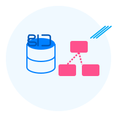

# React SQL Flow

<div align="center">
  
  <h3>Visualizador de Esquemas SQL com Interface Interativa</h3>
</div>

## 📋 Sobre o Projeto

**React SQL Flow** é uma ferramenta de visualização que permite transformar scripts SQL em diagramas de banco de dados interativos. O projeto facilita a compreensão visual de estruturas de banco de dados, relacionamentos entre tabelas e dependências de chaves estrangeiras.

A ferramenta permite que você:

- 🔄 Converta scripts SQL em diagramas visuais
- 🔍 Visualize tabelas, colunas, chaves primárias e estrangeiras
- 👆 Arraste, reposicione e redimensione tabelas interativamente
- 🔗 Veja relacionamentos entre tabelas com conexões animadas

## 🚀 Tecnologias Utilizadas

### Core Framework

- **React**: Framework de UI para construção de interfaces modernas e reativas.
- **TypeScript**: Adiciona tipagem estática ao JavaScript, melhorando a segurança do código e a experiência de desenvolvimento.
- **Vite**: Build tool extremamente rápida para desenvolvimento moderno em front-end.

### Bibliotecas Principais

- **React Flow**: Biblioteca para criação de diagramas e grafos interativos.
  - *Por que?* Oferece suporte completo para criação de nós customizados, conexões interativas e eventos de arrasto, essenciais para a manipulação dos diagramas de banco de dados.

- **Zustand**: Gerenciador de estado minimalista mas poderoso.
  - *Por que?* Permite gerenciar o estado global da aplicação com menos boilerplate que o Redux, mantendo a performance e a simplicidade de uso.

### Estilização

- **TailwindCSS**: Framework CSS utility-first para design rápido e responsivo.
  - *Por que?* Facilita a criação de componentes estilizados sem a necessidade de escrever CSS separado, acelera o desenvolvimento e mantém consistência visual.

### Parsing SQL

- **Parser SQL Customizado**: Implementação própria para interpretação de scripts SQL.
  - *Por que?* Permite maior controle e flexibilidade na extração das estruturas de tabelas e relacionamentos a partir de scripts SQL para transformá-los em componentes visuais.

## 🏗️ Arquitetura do Projeto

O projeto segue uma estrutura modular com separação clara de responsabilidades:

```
src/
├── components/             # Componentes React
│   ├── ui/                 # Componentes genéricos de UI
│   └── flow/               # Componentes específicos do diagrama
│       ├── hooks/          # Custom hooks para lógica do diagrama
│       ├── table/          # Componentes para visualização de tabelas
│       └── ...             # Outros componentes do diagrama
├── lib/                    # Bibliotecas e utilitários
│   ├── parser/             # Parser SQL para interpretar scripts
│   └── utils/              # Funções utilitárias
│       └── flow/           # Utilitários para geração de nós e arestas
├── models/                 # Definições de tipos e interfaces
├── store/                  # Gerenciamento de estado global
└── ...
```

### Como Funciona

1. **Parsing SQL**: Os scripts SQL são analisados pelo parser customizado que extrai informações sobre tabelas, colunas e relacionamentos.

2. **Geração de Nós e Arestas**: As informações extraídas são transformadas em nós (tabelas) e arestas (relacionamentos) para o React Flow.

3. **Renderização Interativa**: O diagrama é renderizado, permitindo ao usuário interagir com as tabelas, arrastando, redimensionando e explorando os relacionamentos.

4. **Gerenciamento de Estado**: Toda a lógica de estado é gerenciada pelo Zustand, que mantém as informações sincronizadas entre os diferentes componentes.

## 🔧 Instalação e Uso

```bash
# Clonar o repositório
git clone https://github.com/seu-usuario/react-sql-flow.git
cd react-sql-flow

# Instalar dependências
npm install

# Executar em modo desenvolvimento
npm run dev

# Construir para produção
npm run build
```

## 🌟 Exemplos de Uso

1. Cole seu script SQL no editor à esquerda.
2. Clique em "Process SQL Script".
3. Visualize o diagrama gerado à direita.
4. Interaja com as tabelas, arrastando-as para reposicionar.
5. Redimensione tabelas clicando e arrastando o manipulador no canto inferior direito.

## 🔮 Ideias para Desenvolvimento Futuro

- **Exportação de Diagramas**: Funcionalidade para exportar diagramas como imagens (PNG, SVG) ou PDF.
- **Histórico de Alterações**: Sistema de undo/redo para mudanças no posicionamento das tabelas.
- **Templates de Diagramas**: Layouts pré-definidos para organização automática das tabelas.
- **Suporte a SQL Avançado**: Expandir o parser para suportar views, stored procedures e triggers.
- **Modo Colaborativo**: Permitir que múltiplos usuários visualizem e editem o mesmo diagrama simultaneamente.
- **Detecção de Mudanças**: Capacidade de comparar diferentes versões de schemas SQL.
- **Geração de SQL**: Criar scripts SQL a partir de modificações feitas no diagrama visual.
- **Temas Customizáveis**: Mais opções visuais para personalização do diagrama.
- **Integração com Bancos de Dados**: Conexão direta com MySQL, PostgreSQL, SQL Server para importar estruturas.
- **Suporte a Annotations**: Permitir a adição de notas e documentação às tabelas e colunas.

## 👨‍💻 Contribuindo

Contribuições são bem-vindas! Sinta-se à vontade para abrir issues ou enviar pull requests.

1. Fork o projeto
2. Crie sua feature branch (`git checkout -b feature/amazing-feature`)
3. Commit suas mudanças (`git commit -m 'Add some amazing feature'`)
4. Push para a branch (`git push origin feature/amazing-feature`)
5. Abra um Pull Request

## 📄 Licença

Este projeto está licenciado sob a Licença MIT - veja o arquivo [LICENSE](LICENSE) para detalhes.

---

<div align="center">
  <p>
    Construído com ❤️ usando React, TypeScript e React Flow
  </p>
</div>
